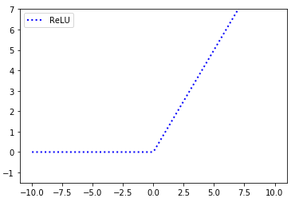
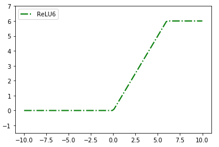
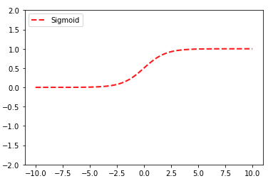
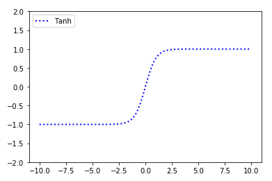
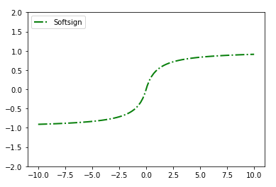
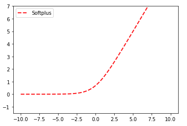
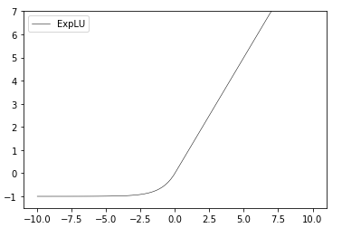

### 1 장 텐서플로 시작

- 텐서플로 동작 방식
  - 데이터셋 가져오기 또는 생성하기
  - 데이터 변환 및 정규화
    - data = tf.nn.batch_norm_with global_normalization(...)
  - 데이터셋을 학습셋, 테스트셋, 검증셋으로 분할
  - 알로리즘 매개변수(초매개변수) 설정
  - 변수 및 플레이스홀더 초기화
  - 모델 구조 정의
  - 비용 함수(loss function) 선언
  - 모델 초기화 및 학습
  - 모델 평가
  - 초매개변수 조정
  - 적용 및 새로운 결과 예측
- 변수 및 텐서 선언 (텐서정의)
  - 고정 텐서
  - 형태가 비슷한 텐서
  - 순열 텐서
  -랜덤 텐서
- 플레이스홀더 및 변수 사용
  - 변수 : 알고리즘에 속한 매개변수로, 텐서플로는 알고리즘을 최적화하기 위해 이 값을 어떻게 변경해야 할지 추적하게 됨
    - ex) x = tf.Variable(tf.zeros([2,2])
  - 플레이스홀더 : 특정 타입과 형태의 데이터를 투입하게 될 객체로, 예상되는 계산 결과 처럼 계산 그래프 구성에 따라 정함
    - ex) x = tf.placeholder(tf.float32, shape=[2,2])
- 행렬 다루기
- 연산 선언 (연산 정의)
- 자주 사용하는 함수 목록

| 함수명  | 설명 |
| :------------ | :-----------: |
| div()     | 나눗셋의 몫을 반환          |
| truedive()    | 정수를 나누기 전에 소수로 변환해 항상 소수인 결과 반환      |
|floordiv() | 소수를 대상으로 정수 나눗셈을 하고 싶을 때|
|mod()|나눗셈의 나머지를 반환|
|cross()|두 텐서의 외적|
|abs()|입력 텐서의 절대값|
|ceil()|입력 텐서의 상한 값 |
|cos()|입력 텐서의 cos 값 |
|exp()|입력 텐서의 밑이 e인 지수 값 |
|floor()|입력 텐서의 하한 값 |
|inv()|입력 텐서의 역수 값 |
|log()|입력 텐서의 자연 로그 값 |
|maximum()|두 텐서에 대한 원소 단위 최대값 |
|minimum()|두 텐서에 대한 원소 단위 최소값 |
|neg()|입력 텐서의 부호 반전 값 |
|pow()|첫번째 텐서의 원소를 두번째 텐서의 해당 원소 값만큼 거듭제곱한 값 |
|round()|입력 텐서의 반올립 값 |
|rsqrt()|입력 텐서의 제곱근의 역수 값 |
|sign()|입력 텐서의 부호에 따라 -1,0,1 값을 반환|
|sin()|입력 텐서의 sin 값 |
|sqrt()|입력 텐서의 제곱근 값 |
|square()|입력 텐서의 제곱 값 |

- 활성화 함수 구현
  - ReLU (수정된 선형 유닛:Rectified Linear Unit) 

    
    - 미분이 간단하여, 속도가 빠르다
    - Gradient Vanishing 문제 해결을 위해 많이 사용되고 있음
    - Gradient Vanishing이란?
      - 0과 1사이의 값을 가지는 sigmoid에서 아주 작은 0에 가까운 값 (0.000001)을 가질 수 있다.
      - 각 Layer를 지나며, 계속해서 아주 작은 값을 가지며 결국 0에 수렴하는 문제 => sigmoid의 가장 큰 단점
    - ReLU의 단점 : 한번 음수가 나오면 0으로 출력하므로, 더이상 진행이 되지 않는다.  

  - ReLU6
  
    
    - ReLU 함수의 선형증가 부분에 상한을 설정
    - 값이 무한정 커지는 문제를 방지

  - sigmoid
  
    
    - 항상 0과 1사이의 값만 갖도록하는 비선형 함수
    - 단순 0과 1이 아닌, 그 사이 모든 값을 가지며 미분 가능하므로 확률로 해석할 때 유용하게 사용됨
    - Gradient Vanishing 문제가 있다   
    
  - tanh (하이퍼볼릭 탄젠트 함수)
  
    
    - 함수값의 범위가 -1과 1사이. (시그모이드와 형태는 동일하나, 표현가능 범위가 넓다)
    - 시그모이드의 크기와 위치를 조절한 함수로, 0을 기준으로 대칭이기에 학습 속도가 빠르다 
    - 시그모이드와 동일하게 Gradient Vanishing 문제가 있다.
    
  - softsign
  
    
    - +1/-1을 만드는 부호함수를 부드럽게 변형한 함수
    - tanh의 대안으로 등장하였음
  
  - softplus
  
    
    - 부드러운 ReLU
    - ReLU의 안정성을 보완하기 위해 사용되는 함수
   
  - ELU(지수 선형 유닛:Exponential Linear Unit) 
  
    
    - softplus와 동일한 특성을 가지는 함수
    - 하부 점근선이 0이 아닌, -1이라는 점이 다르다.
    
    
- 데이터 출처 사용
  - 붓꽃 데이터
  - 신생아 체중 데이터
  - 보스턴 주택 데이터
  - MNIST 필기 데이터
  - 스팸 - 비스팸 문자 데이터
  - 영화 리뷰 데이터
  - CIFAR-10 이미지 데이터
  - 셰익스피어 작품 데이터
  - 영어-독일어 문장 번역 데이
- 추가 자료
